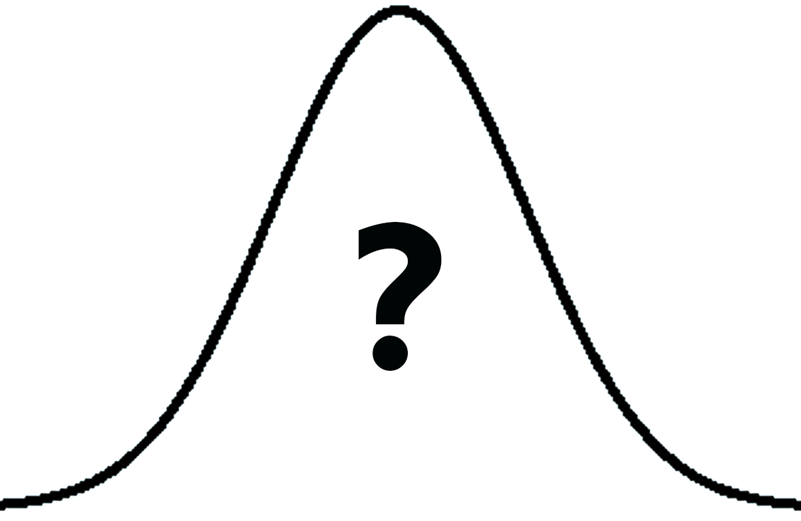

## The Applications of KNN

#### Classification Tasks

	

As a simple classification algorithm, KNN is usually set up as a baseline algorithm for solving a bunch of classification problem, such as handwritten digit recognition. On the famous MNIST dataset, KNN using Euclidean distance can achieve more than 98% test accuracy without any preprocessing.

#### Density Estimation

	

Since KNN is nonparametric, it can do estimation for arbitrary distributions. Density estimation is to estimate the underlying probability distribution of the data by using the given data set. For estimating the density at a point xi, for instance, place a hypercube centered at xi and keep increasing its size till k neighbors are captured. And so the density at point xi can be estimated as $$p(x_{i}) = \frac{k}{nV}$$ where n is the number of data points in the given data set, and V is the volume of the hypercube.

